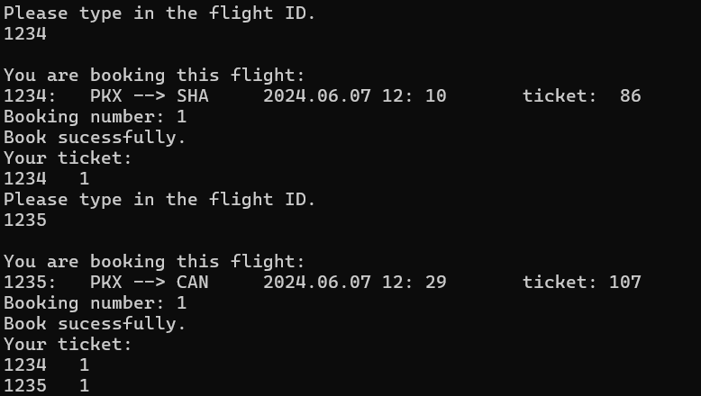

# AirlineBookingSystem
This project is an interactive airline booking system.    
    

## Functions
-Input the information of each flight (flight information is saved in files) After passengers book some tickets, the number of remaining tickets of the flight will be updated in time. 

-Information browsing of each flight.

-The user can query the flight by flight ID, departure time and terminal.

-Booking business.

-Refund business.

## Directions for Use
Enter the system, see the following page:

Choose the function and type in the number.

Remember: Always press 0 to return the last step!

The 1 and 2 functions don't need to log in, while 3 and 4 need to log in.

Create a new account at the first time and set your password. You can log in to this account next time.

After you book a ticket, you can continue to book other tickets until you press 0 to exit. Refund is as the same.

## Contact Author
If you have any ideas about this project, you are welcome to share your thoughts.

Email: ma.athena@hotmail.com

## Special Thanks
Thanks to my object-oriented programming teacher Song, without her meticulous and patient explanation, I could not have learned object-oriented programming so well.

